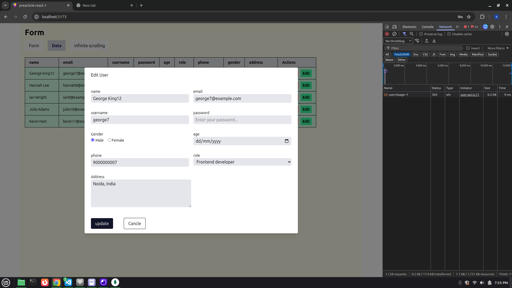
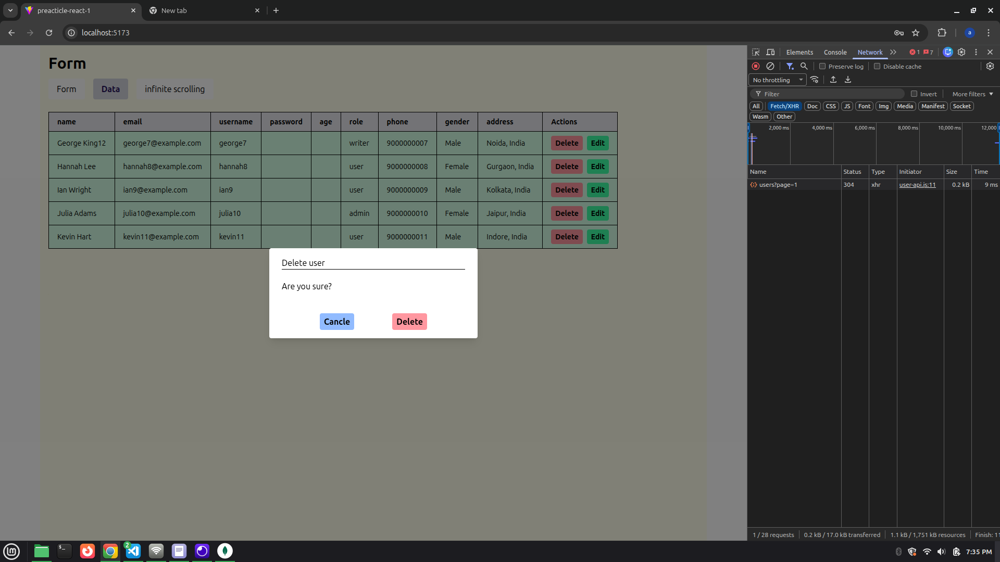
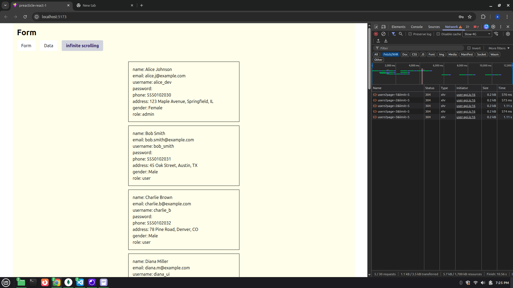
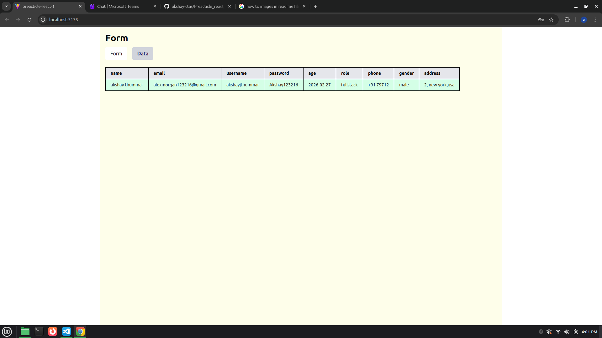
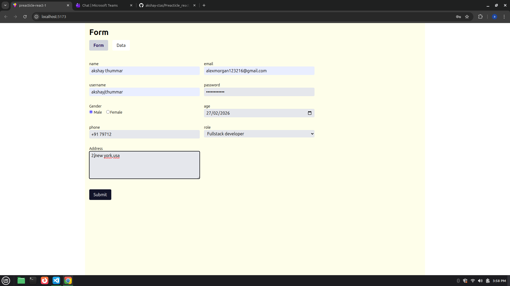

04-02-2026
Update Data- make endpoint in backend and build seprate popupmode make interactive with use useMutation

Delete Data- make endpoint in backend and build seprate popupmode make interactive with use useMutation

